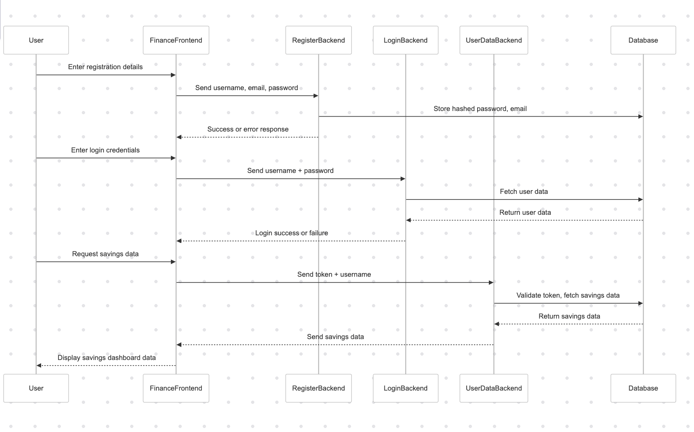

## Architecture Diagram

## 1. Introduction
- **Project Name:** Finance Budgeter
- **Team:** Team-GECCO
- **Date:** 06/02/2025
- **Version** 1.0
- **Purpose**
  The finance budgeter is a react web application that helps users to plan for financial goals such as a mortage deposit.

---

## 2. System Overview
### Description:
The application allows users to:
- Register and log in securely.
- Define financial goals (e.g mortage, car finance, general savings etc).
- Input their monthly income and budget their savings appropriately across their desired areas.
- Save a budgetting plan to a dashboard or to a PDF if they dont want to log in.

### Scope
- **In-Scope:** User authentication, goal tracking, secure data storage, finance dahsboard, pdf saving.
- **Out-Of-Scope:** Payments processing, investment recomendation, tracking of saving process

## Key Features: 
- Secure Authentication (Hashed passswords).
- Integration with the backend.
- Budget visualisation.
- PDF savings.
- specific calculators for different saving processes.

## System Components
### **Frontend:**
- **Finance Frontend:**
    - React UI for getting user info of income, and data visualisation
    - Sends login credentials to the backend
    - Sends user finance savings plan to backend if authenticated

### **Backend Services:**
- **Register Backend:** Handles new user registration, sotres the hashed password and email in the database.
- **Login Backend:** Authenticates users, provides an access token to the frontend and stores one in the db for authentication with an expiration.
- **User Data Backend:** Handles retrieval and updates of user financial data.

### **Database:**
- Stores user credentials, financial plans, pdfs

## 4. Data Flow Diagram

## 5. System Architecture Diagram

